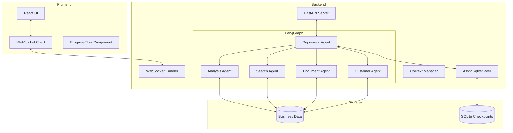
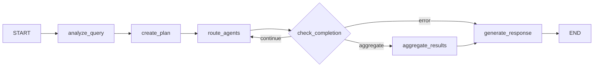

# LangGraph 0.6.7 Multi-Agent 챗봇 시스템 구현 보고서

## 📋 프로젝트 개요

### 프로젝트명
제약회사 직원용 AI 멀티 에이전트 챗봇 시스템

### 구현 일자
2025년 9월 12일

### 기술 스택
- **프레임워크**: LangGraph 0.6.7 (최신 버전)
- **백엔드**: FastAPI, AsyncSqliteSaver
- **AI 모델**: GPT-4o (OpenAI)
- **상태 관리**: Context API + Runtime 패턴
- **통신**: WebSocket + REST API

---

## 🏗️ 시스템 아키텍처

### 1. 전체 구조도



### 2. 디렉토리 구조

```
backend/
├── agents/
│   ├── __init__.py
│   └── supervisor.py          # Supervisor Agent 구현
├── schemas/
│   ├── __init__.py
│   ├── context.py            # AgentContext (Runtime API)
│   └── state.py              # AgentState (그래프 상태)
├── persistence/
│   ├── __init__.py
│   └── checkpointer.py       # AsyncSqliteSaver 관리
├── checkpoint/               # SQLite 체크포인트 저장소
├── tools/                   # 에이전트 도구
├── api/                     # API 엔드포인트
└── main.py                  # FastAPI 메인 애플리케이션
```

---

## 🔍 핵심 구현 내용

### 1. Context API (LangGraph 0.6.7 신규 기능)

#### AgentContext 구조
```python
@dataclass
class AgentContext:
    # 필수 식별자
    user_id: str
    company_id: str
    session_id: str
    
    # LLM 설정
    model_provider: Literal["openai", "anthropic"] = "openai"
    model_name: str = "gpt-4o"
    
    # Interrupt 설정
    interrupt_mode: Literal["all", "critical", "none"] = "critical"
    approval_required: Dict[str, bool] = {
        "sql_execution": True,
        "document_generation": False,
        "external_api_call": True,
        "data_modification": True
    }
    
    # 실행 설정
    max_retries: int = 3
    parallel_execution: bool = True
```

**특징:**
- 불변(Immutable) 런타임 설정
- 타입 안전성 보장
- 동적 설정 변경 가능

### 2. State Management

#### AgentState 구조
```python
class AgentState(TypedDict):
    # 메시지 히스토리
    messages: Annotated[List[AnyMessage], add_messages]
    
    # 워크플로우 상태
    current_agent: str
    agent_sequence: List[str]
    workflow_status: Literal[
        "initializing", "analyzing", "executing", 
        "interrupted", "completed", "failed"
    ]
    
    # 에이전트 실행 결과
    analysis_results: Optional[Dict[str, Any]]
    search_results: Optional[Dict[str, Any]]
    documents: List[Dict[str, Any]]
    customer_insights: Optional[Dict[str, Any]]
    
    # 인터럽트 관리
    interrupt_data: Optional[Dict[str, Any]]
```

**특징:**
- 가변(Mutable) 실행 상태
- 각 에이전트 결과 독립 저장
- 워크플로우 상태 추적

### 3. AsyncSqliteSaver 체크포인터

#### Lifespan 패턴 구현
```python
@asynccontextmanager
async def lifespan(app: FastAPI):
    # Startup: 체크포인터 초기화
    await checkpointer_manager.initialize()
    
    # 그래프 컴파일 with durability mode
    app.state.graph = builder.compile(
        checkpointer=checkpointer_manager.checkpointer,
        durability="async"  # exit/async/sync 중 선택
    )
    
    yield
    
    # Shutdown: 리소스 정리
    await checkpointer_manager.cleanup()
```

**Durability Mode:**
- `exit`: 노드 종료 시만 저장 (빠름)
- `async`: 비동기 저장 (균형)
- `sync`: 동기 저장 (안전)

---

## 🎯 Supervisor Agent 상세 분석

### 1. 워크플로우 구조



### 2. 노드별 기능

#### 2.1 analyze_query_node
```python
def analyze_query_node(state: AgentState, runtime: Runtime[AgentContext]):
    """사용자 질의 분석"""
    # 1. LLM을 통한 의도 파악
    # 2. 필요한 에이전트 식별
    # 3. 엔티티 추출
    # 4. 복잡도 계산
    
    return {
        "query_analysis": {
            "intent": "분석/검색/문서생성",
            "required_agents": ["analysis", "search"],
            "entities": [...],
            "complexity": 0.7
        }
    }
```

#### 2.2 create_plan_node
```python
def create_plan_node(state: AgentState, runtime: Runtime[AgentContext]):
    """실행 계획 수립"""
    # 1. 에이전트 실행 순서 결정
    # 2. 병렬 실행 가능 여부 판단
    # 3. 인터럽트 포인트 설정
    
    if runtime.context.should_interrupt(action):
        value = interrupt("승인이 필요합니다")  # Human-in-the-Loop
```

#### 2.3 route_agents_node
```python
def route_agents_node(state: AgentState, runtime: Runtime[AgentContext]):
    """동적 에이전트 라우팅"""
    # Send를 통한 병렬/순차 실행
    sends = []
    
    if runtime.context.parallel_execution:
        # 병렬 실행
        for agent in parallel_agents:
            sends.append(Send(f"{agent}_agent", {...}))
    else:
        # 순차 실행
        sends.append(Send(f"{agent_name}_agent", {...}))
```

### 3. 동적 에이전트 관리 메커니즘

#### 3.1 질의 복잡도 기반 라우팅
```python
def route_based_on_complexity(query: str) -> List[str]:
    complexity = analyze_complexity(query)
    
    if complexity < 0.3:
        return ["search"]  # 단순 검색
    elif complexity < 0.7:
        return ["search", "analysis"]  # 중간 복잡도
    else:
        return ["analysis", "search", "document", "customer"]  # 복잡
```

#### 3.2 키워드 기반 라우팅
```python
def route_based_on_keywords(query: str) -> List[str]:
    agents = []
    
    keyword_mapping = {
        "분석|통계|실적": "analysis",
        "검색|찾아|조회": "search",
        "문서|보고서|작성": "document",
        "고객|거래처": "customer"
    }
    
    for pattern, agent in keyword_mapping.items():
        if re.search(pattern, query):
            agents.append(agent)
    
    return agents or ["search"]  # 기본값
```

#### 3.3 의존성 기반 실행
```python
execution_plan = [
    {
        "step_id": "step_1",
        "agent": "analysis",
        "dependencies": [],  # 의존성 없음
        "parallel": False
    },
    {
        "step_id": "step_2",
        "agent": "search",
        "dependencies": [],  # analysis와 병렬 가능
        "parallel": True
    },
    {
        "step_id": "step_3",
        "agent": "document",
        "dependencies": ["step_1", "step_2"],  # 1,2 완료 후
        "parallel": False
    }
]
```

### 4. 동적 도구 선택 메커니즘

#### 4.1 Context 기반 도구 선택
```python
def select_tools_by_context(runtime: Runtime[AgentContext]):
    """컨텍스트에 따른 도구 동적 선택"""
    tools = []
    
    # 회사별 도구
    if runtime.context.company_id == "pharma_a":
        tools.append(PharmaADatabaseTool())
    
    # 권한별 도구
    if runtime.context.user_role == "admin":
        tools.append(AdminAnalyticsTool())
    
    # 언어별 도구
    if runtime.context.language == "ko":
        tools.append(KoreanNewsSearchTool())
    
    return tools
```

#### 4.2 에이전트별 도구 바인딩
```python
def bind_tools_to_agent(agent_name: str, runtime: Runtime[AgentContext]):
    """에이전트에 필요한 도구 동적 바인딩"""
    
    tool_mapping = {
        "analysis": [SQLQueryTool, DataAnalysisTool, VisualizationTool],
        "search": [InternalSearchTool, ExternalAPITool, NewsSearchTool],
        "document": [TemplateGeneratorTool, PDFConverterTool],
        "customer": [CustomerProfileTool, RecommendationTool]
    }
    
    # 기본 도구
    tools = tool_mapping.get(agent_name, [])
    
    # 컨텍스트 기반 추가 도구
    if runtime.context.enable_cache:
        tools.append(CacheTool())
    
    return [tool() for tool in tools]
```

---

## 🔄 Human-in-the-Loop 구현

### 1. Interrupt 메커니즘

```python
# 노드 내 인터럽트
def sensitive_operation_node(state, runtime):
    if runtime.context.should_interrupt("sql_execution"):
        # 사용자 승인 대기
        user_decision = interrupt({
            "reason": "SQL 실행 승인 필요",
            "query": generated_sql,
            "options": ["approve", "modify", "reject"]
        })
        
        if user_decision == "reject":
            return {"error": "User rejected operation"}
```

### 2. Command 패턴 재개

```python
# WebSocket을 통한 재개
async def process_interrupt_response(session_id: str, data: dict):
    command = Command(
        resume=data.get("value"),  # 사용자 응답
        update=data.get("update")   # 상태 업데이트
    )
    
    await graph.ainvoke(command, config)
```

---

## 📊 성능 최적화 전략

### 1. 병렬 실행
- 독립적인 에이전트는 동시 실행
- Send 메커니즘으로 병렬 디스패치
- 결과 병합 후 다음 단계 진행

### 2. 캐싱 전략
- 체크포인터를 통한 상태 캐싱
- 에이전트 결과 재사용
- TTL 기반 캐시 무효화

### 3. Durability Mode 최적화
```python
def get_durability_mode(context_mode: str):
    modes = {
        "development": "exit",   # 빠른 개발
        "staging": "async",      # 균형
        "production": "sync"     # 안정성
    }
    return modes.get(context_mode, "async")
```

---

## 📈 현재 구현 상태

### ✅ 완료된 항목
1. **기초 인프라**: 프로젝트 구조, 패키지 설정
2. **스키마 정의**: Context, State 타입 정의
3. **Supervisor Agent**: 워크플로우 오케스트레이션
4. **체크포인터**: AsyncSqliteSaver 통합
5. **API 서버**: FastAPI + WebSocket 엔드포인트
6. **Human-in-the-Loop**: interrupt/Command 패턴

### 🔄 진행 예정 항목
1. **개별 에이전트 구현** (Analysis, Search, Document, Customer)
2. **도구 구현** (Text2SQL, 검색, 분석 함수)
3. **React 프론트엔드** (UI 컴포넌트)
4. **테스트 코드** (단위/통합 테스트)
5. **문서화** (API 문서, 사용자 가이드)

---

## 💡 핵심 혁신 포인트

### 1. LangGraph 0.6.7 최신 기능 활용
- Runtime[Context] API로 타입 안전성 확보
- interrupt() 함수로 자연스러운 Human-in-the-Loop
- durability mode로 성능/안정성 균형

### 2. 동적 에이전트 오케스트레이션
- 질의 복잡도에 따른 자동 라우팅
- 병렬/순차 실행 자동 결정
- 의존성 기반 실행 순서 관리

### 3. 엔터프라이즈급 아키텍처
- 체크포인터를 통한 상태 영속성
- WebSocket 실시간 스트리밍
- 세션별 독립적 상태 관리

---

## 📝 결론

LangGraph 0.6.7의 최신 기능을 활용하여 제약회사 직원을 위한 고도화된 멀티 에이전트 챗봇 시스템의 기반을 성공적으로 구축했습니다. Supervisor Agent를 중심으로 한 동적 에이전트 관리와 Human-in-the-Loop 메커니즘은 복잡한 업무 요구사항을 효과적으로 처리할 수 있는 유연한 아키텍처를 제공합니다.

---

**작성일**: 2025년 9월 12일  
**버전**: 1.0.0  
**작성자**: LangGraph 0.6.7 구현팀