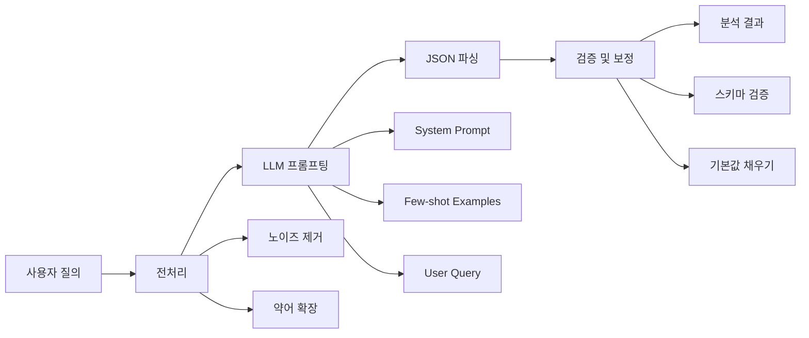

# LLM 분석 및 계획 수립 메커니즘 상세 가이드

## 🎯 개요

Supervisor Agent의 핵심은 **GPT-4o를 활용한 지능형 질의 분석과 동적 계획 수립**입니다. 이 문서는 LLM이 어떻게 사용자의 복잡한 질의를 이해하고, 최적의 실행 계획을 수립하는지 상세히 설명합니다.

---

## 📊 LLM 분석 프로세스

### 1. 질의 분석 파이프라인



### 2. 프롬프트 엔지니어링 전략

#### 2.1 구조화된 System Prompt

```python
ANALYSIS_SYSTEM_PROMPT = """
당신은 제약회사 전문 AI 분석가입니다. 
사용자 질문을 다음 프레임워크로 분석하세요:

## 분석 프레임워크

### 1. 의도 분류 (Intent Classification)
- **analysis**: 데이터 분석, 통계, 트렌드, 실적 관련
- **search**: 정보 검색, 자료 찾기, 데이터 조회
- **document**: 보고서 작성, 문서 생성, 템플릿 활용
- **customer**: 고객/거래처 분석, 관계 관리

### 2. 복잡도 평가 (Complexity Assessment)
```
0.0-0.3: 단순 조회 (예: "A병원 연락처는?")
0.3-0.5: 기본 분석 (예: "이번달 매출은?")
0.5-0.7: 복합 분석 (예: "전년 대비 성장률 분석")
0.7-0.9: 심화 분석 (예: "지역별 제품별 실적 비교 분석")
0.9-1.0: 통합 분석 (예: "전사 통합 리포트 생성")
```

### 3. 엔티티 추출 (Entity Extraction)
- **회사/거래처**: 병원, 약국, 제약회사명
- **제품**: 의약품명, 제품 카테고리
- **시간**: 기간, 날짜, 분기, 년도
- **지역**: 도시, 지역, 영업소
- **지표**: 매출, 수량, 점유율 등

### 4. 필요 에이전트 매핑
질의 패턴별 에이전트 조합:
- 단순 조회 → [search]
- 실적 분석 → [analysis, search]
- 보고서 작성 → [search, analysis, document]
- 고객 전략 → [customer, analysis, search]

## 출력 형식
반드시 다음 JSON 스키마를 따르세요:
{
    "intent": "primary_intent",
    "required_agents": ["agent1", "agent2"],
    "entities": [
        {"type": "entity_type", "value": "entity_value", "confidence": 0.95}
    ],
    "complexity": 0.0-1.0,
    "keywords": ["key1", "key2"],
    "context_needed": true/false,
    "suggested_followup": ["possible_question1"]
}
"""
```

#### 2.2 Few-shot Learning Examples

```python
FEW_SHOT_EXAMPLES = [
    {
        "query": "한국제약 3분기 타이레놀 매출 실적 분석해줘",
        "analysis": {
            "intent": "analysis",
            "required_agents": ["analysis", "search"],
            "entities": [
                {"type": "company", "value": "한국제약", "confidence": 1.0},
                {"type": "period", "value": "3분기", "confidence": 1.0},
                {"type": "product", "value": "타이레놀", "confidence": 1.0},
                {"type": "metric", "value": "매출", "confidence": 0.95}
            ],
            "complexity": 0.6,
            "keywords": ["매출", "실적", "분석", "3분기"],
            "context_needed": false,
            "suggested_followup": [
                "전년 동기 대비 성장률은?",
                "경쟁사 대비 실적은?"
            ]
        }
    },
    {
        "query": "서울지역 주요 병원 리스트와 담당자 연락처 찾아서 방문 계획서 만들어줘",
        "analysis": {
            "intent": "document",
            "required_agents": ["search", "customer", "document"],
            "entities": [
                {"type": "region", "value": "서울지역", "confidence": 1.0},
                {"type": "customer_type", "value": "병원", "confidence": 1.0},
                {"type": "document_type", "value": "방문 계획서", "confidence": 0.9}
            ],
            "complexity": 0.75,
            "keywords": ["병원", "리스트", "담당자", "방문", "계획서"],
            "context_needed": true,
            "suggested_followup": [
                "방문 우선순위 설정 기준은?",
                "이전 방문 이력 확인"
            ]
        }
    }
]
```

### 3. LLM 호출 최적화

#### 3.1 Temperature 조정 전략

```python
def get_optimal_temperature(query_type):
    """질의 타입별 최적 temperature 설정"""
    
    TEMPERATURE_MAP = {
        "factual_lookup": 0.1,      # 사실 조회: 일관성 중요
        "analysis": 0.3,            # 분석: 약간의 창의성
        "creative_document": 0.7,   # 문서 생성: 창의성 필요
        "brainstorming": 0.9        # 아이디어: 높은 창의성
    }
    
    # 질의 특성 분석
    if "정확한" in query or "구체적" in query:
        return 0.1
    elif "분석" in query or "비교" in query:
        return 0.3
    elif "제안" in query or "추천" in query:
        return 0.5
    else:
        return 0.7
```

#### 3.2 토큰 최적화

```python
class TokenOptimizer:
    def optimize_prompt(self, base_prompt, max_tokens=2000):
        """프롬프트 토큰 최적화"""
        
        # 토큰 카운트
        current_tokens = self.count_tokens(base_prompt)
        
        if current_tokens > max_tokens:
            # 우선순위별 압축
            optimized = self.compress_prompt(base_prompt, {
                "examples": 0.3,      # 30% 유지
                "instructions": 0.9,  # 90% 유지
                "context": 0.5       # 50% 유지
            })
            return optimized
        
        return base_prompt
    
    def compress_prompt(self, prompt, retention_rates):
        """선택적 프롬프트 압축"""
        sections = self.parse_sections(prompt)
        compressed = {}
        
        for section, content in sections.items():
            rate = retention_rates.get(section, 1.0)
            if rate < 1.0:
                # 중요도 기반 문장 선택
                compressed[section] = self.select_important(content, rate)
            else:
                compressed[section] = content
        
        return self.reconstruct_prompt(compressed)
```

---

## 🗺️ 동적 계획 수립 메커니즘

### 1. 계획 수립 알고리즘

#### 1.1 의존성 그래프 구축

```python
class DependencyGraphBuilder:
    """에이전트 간 의존성 그래프 구축"""
    
    # 에이전트 의존성 정의
    AGENT_DEPENDENCIES = {
        "analysis": {
            "requires": [],  # 독립적
            "provides": ["statistics", "insights", "trends"]
        },
        "search": {
            "requires": [],  # 독립적
            "provides": ["raw_data", "documents", "information"]
        },
        "document": {
            "requires": ["raw_data", "statistics"],  # search, analysis 필요
            "provides": ["reports", "presentations"]
        },
        "customer": {
            "requires": ["raw_data"],  # search 필요
            "provides": ["customer_insights", "recommendations"]
        }
    }
    
    def build_graph(self, required_agents):
        """의존성 그래프 생성"""
        graph = {}
        
        for agent in required_agents:
            dependencies = []
            agent_requires = self.AGENT_DEPENDENCIES[agent]["requires"]
            
            for other_agent in required_agents:
                if agent != other_agent:
                    other_provides = self.AGENT_DEPENDENCIES[other_agent]["provides"]
                    
                    # 의존성 체크
                    if any(req in other_provides for req in agent_requires):
                        dependencies.append(other_agent)
            
            graph[agent] = dependencies
        
        return graph
    
    def topological_sort(self, graph):
        """토폴로지 정렬로 실행 순서 결정"""
        in_degree = {node: 0 for node in graph}
        
        for node in graph:
            for dep in graph[node]:
                in_degree[dep] += 1
        
        queue = [node for node in graph if in_degree[node] == 0]
        result = []
        
        while queue:
            # 같은 레벨 노드들 (병렬 실행 가능)
            level = []
            next_queue = []
            
            for node in queue:
                level.append(node)
                for neighbor in graph[node]:
                    in_degree[neighbor] -= 1
                    if in_degree[neighbor] == 0:
                        next_queue.append(neighbor)
            
            result.append(level)
            queue = next_queue
        
        return result
```

#### 1.2 실행 계획 생성

```python
class ExecutionPlanner:
    def create_execution_plan(self, query_analysis):
        """분석 결과를 바탕으로 실행 계획 생성"""
        
        plan = {
            "version": "1.0",
            "created_at": datetime.now().isoformat(),
            "query_complexity": query_analysis["complexity"],
            "steps": []
        }
        
        # 1. 의존성 그래프 구축
        dep_builder = DependencyGraphBuilder()
        dep_graph = dep_builder.build_graph(query_analysis["required_agents"])
        
        # 2. 실행 순서 결정 (토폴로지 정렬)
        execution_levels = dep_builder.topological_sort(dep_graph)
        
        # 3. 각 레벨별 실행 계획 생성
        step_id = 1
        for level_idx, agents_in_level in enumerate(execution_levels):
            
            # 병렬 실행 가능 여부
            can_parallel = len(agents_in_level) > 1
            
            for agent in agents_in_level:
                step = {
                    "step_id": f"step_{step_id}",
                    "agent_name": agent,
                    "execution_level": level_idx,
                    "parallel": can_parallel,
                    "dependencies": dep_graph.get(agent, []),
                    "estimated_time": self.estimate_time(agent, query_analysis),
                    "priority": self.calculate_priority(agent, query_analysis),
                    "retry_policy": self.get_retry_policy(agent),
                    "timeout": self.calculate_timeout(agent, query_analysis)
                }
                
                plan["steps"].append(step)
                step_id += 1
        
        # 4. 최적화 적용
        plan = self.optimize_plan(plan, query_analysis)
        
        return plan
    
    def estimate_time(self, agent, analysis):
        """에이전트별 예상 실행 시간 계산"""
        
        BASE_TIMES = {
            "analysis": 5,
            "search": 3,
            "document": 8,
            "customer": 4
        }
        
        base = BASE_TIMES.get(agent, 5)
        
        # 복잡도 가중치
        complexity_factor = 1 + analysis["complexity"]
        
        # 엔티티 수 가중치
        entity_factor = 1 + (len(analysis["entities"]) * 0.1)
        
        return base * complexity_factor * entity_factor
    
    def calculate_priority(self, agent, analysis):
        """에이전트 우선순위 계산"""
        
        PRIORITY_WEIGHTS = {
            "analysis": 0.9,   # 높은 우선순위
            "search": 0.8,
            "customer": 0.6,
            "document": 0.5    # 낮은 우선순위 (의존적)
        }
        
        base_priority = PRIORITY_WEIGHTS.get(agent, 0.5)
        
        # 사용자 의도와 일치도
        intent_match = 1.0 if analysis["intent"] == agent else 0.7
        
        return base_priority * intent_match
```

### 2. 계획 최적화 전략

#### 2.1 병렬 처리 최적화

```python
class ParallelOptimizer:
    def optimize_for_parallel(self, plan):
        """병렬 처리 최적화"""
        
        optimized_steps = []
        
        for level in self.group_by_level(plan["steps"]):
            # 리소스 제약 확인
            if self.can_run_parallel(level):
                # 병렬 실행 마킹
                for step in level:
                    step["execution_mode"] = "parallel"
                    step["thread_pool"] = "shared"
            else:
                # 우선순위 기반 순차 실행
                sorted_level = sorted(level, 
                                    key=lambda x: x["priority"], 
                                    reverse=True)
                for idx, step in enumerate(sorted_level):
                    step["execution_mode"] = "sequential"
                    step["execution_order"] = idx
            
            optimized_steps.extend(level)
        
        plan["steps"] = optimized_steps
        return plan
    
    def can_run_parallel(self, steps):
        """병렬 실행 가능 여부 판단"""
        
        # 리소스 계산
        total_memory = sum(self.estimate_memory(s) for s in steps)
        total_cpu = sum(self.estimate_cpu(s) for s in steps)
        
        # 임계값 체크
        return (total_memory < MAX_MEMORY_THRESHOLD and 
                total_cpu < MAX_CPU_THRESHOLD and
                len(steps) <= MAX_PARALLEL_AGENTS)
```

#### 2.2 캐싱 전략

```python
class CachingStrategy:
    def apply_caching(self, plan, historical_data):
        """캐싱 전략 적용"""
        
        for step in plan["steps"]:
            agent = step["agent_name"]
            
            # 캐시 가능성 평가
            cache_score = self.evaluate_cachability(step, historical_data)
            
            if cache_score > 0.7:
                step["cache_strategy"] = "aggressive"
                step["cache_ttl"] = 3600  # 1시간
            elif cache_score > 0.4:
                step["cache_strategy"] = "moderate"
                step["cache_ttl"] = 900   # 15분
            else:
                step["cache_strategy"] = "minimal"
                step["cache_ttl"] = 300    # 5분
            
            # 캐시 키 생성 전략
            step["cache_key_pattern"] = self.generate_cache_key_pattern(step)
        
        return plan
    
    def evaluate_cachability(self, step, historical_data):
        """캐시 가능성 점수 계산"""
        
        score = 0.0
        
        # 1. 에이전트 타입별 기본 점수
        cachable_agents = {"search": 0.8, "analysis": 0.6}
        score += cachable_agents.get(step["agent_name"], 0.3)
        
        # 2. 히스토리 기반 재사용률
        reuse_rate = historical_data.get_reuse_rate(step["agent_name"])
        score += reuse_rate * 0.3
        
        # 3. 데이터 변동성
        volatility = historical_data.get_data_volatility(step["agent_name"])
        score -= volatility * 0.2
        
        return min(max(score, 0.0), 1.0)
```

### 3. 인터럽트 포인트 설정

#### 3.1 동적 인터럽트 결정

```python
class InterruptManager:
    def set_interrupt_points(self, plan, context):
        """동적 인터럽트 포인트 설정"""
        
        for step in plan["steps"]:
            # 기본 인터럽트 필요 여부
            requires_interrupt = self.check_base_requirements(step, context)
            
            # 동적 조건 평가
            if not requires_interrupt:
                requires_interrupt = self.evaluate_dynamic_conditions(step, context)
            
            if requires_interrupt:
                step["interrupt"] = {
                    "enabled": True,
                    "type": self.determine_interrupt_type(step),
                    "message": self.generate_interrupt_message(step),
                    "options": self.get_interrupt_options(step),
                    "timeout": 60,  # 60초 대기
                    "default_action": "proceed"  # 타임아웃 시 기본 동작
                }
            else:
                step["interrupt"] = {"enabled": False}
        
        return plan
    
    def check_base_requirements(self, step, context):
        """기본 인터럽트 요구사항 체크"""
        
        # 컨텍스트 모드 확인
        if context.interrupt_mode == "none":
            return False
        if context.interrupt_mode == "all":
            return True
        
        # Critical 모드: 특정 작업만
        critical_actions = [
            "sql_execution",
            "data_modification",
            "external_api_call",
            "document_generation"
        ]
        
        return any(action in step.get("action", "").lower() 
                  for action in critical_actions)
    
    def evaluate_dynamic_conditions(self, step, context):
        """동적 조건 평가"""
        
        # 비용 임계값 체크
        if step.get("estimated_cost", 0) > context.cost_threshold:
            return True
        
        # 민감 데이터 접근
        if step.get("accesses_sensitive_data", False):
            return True
        
        # 사용자 정의 규칙
        for rule in context.custom_rules:
            if rule.matches(step):
                return True
        
        return False
```

---

## 🚀 고급 최적화 기법

### 1. 적응형 학습 시스템

```python
class AdaptiveLearningSystem:
    def __init__(self):
        self.performance_history = []
        self.pattern_database = {}
        
    def learn_from_execution(self, query, plan, result):
        """실행 결과로부터 학습"""
        
        # 성능 메트릭 수집
        metrics = {
            "query_pattern": self.extract_pattern(query),
            "plan_efficiency": self.calculate_efficiency(plan, result),
            "user_satisfaction": result.get("satisfaction", 0.5),
            "execution_time": result["total_time"],
            "resource_usage": result["resources"]
        }
        
        # 패턴 데이터베이스 업데이트
        pattern = metrics["query_pattern"]
        if pattern not in self.pattern_database:
            self.pattern_database[pattern] = []
        
        self.pattern_database[pattern].append({
            "plan": plan,
            "metrics": metrics
        })
        
        # 최적 전략 재계산
        self.recalculate_optimal_strategies()
    
    def suggest_plan_improvements(self, current_plan):
        """현재 계획 개선 제안"""
        
        improvements = []
        
        # 유사 패턴의 성공 사례 찾기
        similar_successful = self.find_similar_successful_plans(current_plan)
        
        for success_case in similar_successful:
            diff = self.calculate_plan_diff(current_plan, success_case["plan"])
            
            if diff["improvement_potential"] > 0.2:
                improvements.append({
                    "suggestion": diff["changes"],
                    "expected_improvement": diff["improvement_potential"],
                    "confidence": diff["confidence"]
                })
        
        return sorted(improvements, 
                     key=lambda x: x["expected_improvement"], 
                     reverse=True)
```

### 2. 컨텍스트 인식 향상

```python
class ContextAwareAnalyzer:
    def enhance_with_context(self, query, session_history):
        """세션 컨텍스트로 쿼리 강화"""
        
        enhanced_query = {
            "original": query,
            "context_entities": [],
            "implicit_requirements": [],
            "conversation_flow": []
        }
        
        # 1. 대명사 해결
        enhanced_query["resolved"] = self.resolve_references(
            query, 
            session_history
        )
        
        # 2. 암묵적 요구사항 추론
        enhanced_query["implicit_requirements"] = self.infer_requirements(
            query,
            session_history
        )
        
        # 3. 대화 흐름 분석
        enhanced_query["conversation_flow"] = self.analyze_flow(
            session_history
        )
        
        # 4. 관련 컨텍스트 추출
        enhanced_query["context_entities"] = self.extract_context_entities(
            session_history[-5:]  # 최근 5개 대화
        )
        
        return enhanced_query
    
    def resolve_references(self, query, history):
        """대명사 및 참조 해결"""
        
        # 대명사 매핑
        pronouns = {
            "그것": self.find_last_mentioned_entity(history, "object"),
            "그곳": self.find_last_mentioned_entity(history, "location"),
            "그때": self.find_last_mentioned_entity(history, "time"),
            "같은": self.find_last_mentioned_entity(history, "any")
        }
        
        resolved = query
        for pronoun, entity in pronouns.items():
            if pronoun in query and entity:
                resolved = resolved.replace(pronoun, entity)
        
        return resolved
```

### 3. 하이브리드 계획 전략

```python
class HybridPlanningStrategy:
    def create_hybrid_plan(self, query_analysis):
        """규칙 기반 + ML 기반 하이브리드 계획"""
        
        # 1. 규칙 기반 초기 계획
        rule_based_plan = self.create_rule_based_plan(query_analysis)
        
        # 2. ML 모델 예측
        ml_predicted_plan = self.ml_model.predict_plan(query_analysis)
        
        # 3. 두 계획 병합
        hybrid_plan = self.merge_plans(rule_based_plan, ml_predicted_plan)
        
        # 4. 검증 및 조정
        validated_plan = self.validate_and_adjust(hybrid_plan)
        
        # 5. 신뢰도 점수 계산
        validated_plan["confidence_score"] = self.calculate_confidence(
            rule_based_plan,
            ml_predicted_plan,
            validated_plan
        )
        
        return validated_plan
    
    def merge_plans(self, rule_plan, ml_plan):
        """두 계획 병합"""
        
        merged = {
            "steps": [],
            "strategy": "hybrid",
            "sources": {
                "rule_based": rule_plan,
                "ml_based": ml_plan
            }
        }
        
        # 공통 단계 식별
        common_steps = self.find_common_steps(rule_plan, ml_plan)
        
        # 차이점 분석
        differences = self.analyze_differences(rule_plan, ml_plan)
        
        # 최적 조합 선택
        for step_id in range(max(len(rule_plan["steps"]), 
                                len(ml_plan["steps"]))):
            if step_id in common_steps:
                # 공통 단계는 그대로 사용
                merged["steps"].append(common_steps[step_id])
            else:
                # 차이나는 부분은 점수 기반 선택
                best_step = self.select_best_step(
                    rule_plan.get("steps", []).get(step_id),
                    ml_plan.get("steps", []).get(step_id)
                )
                if best_step:
                    merged["steps"].append(best_step)
        
        return merged
```

---

## 📊 성능 모니터링 및 개선

### 1. 실시간 메트릭 수집

```python
class PerformanceMonitor:
    def __init__(self):
        self.metrics = {
            "analysis_accuracy": [],
            "planning_efficiency": [],
            "execution_success_rate": [],
            "user_satisfaction": []
        }
    
    def track_analysis_performance(self, query, predicted, actual):
        """분석 성능 추적"""
        
        accuracy = self.calculate_accuracy(predicted, actual)
        
        self.metrics["analysis_accuracy"].append({
            "timestamp": datetime.now(),
            "query": query,
            "accuracy": accuracy,
            "predicted_intent": predicted["intent"],
            "actual_intent": actual["intent"],
            "agent_match_rate": self.calculate_agent_match(
                predicted["required_agents"],
                actual["required_agents"]
            )
        })
        
        # 실시간 알림
        if accuracy < 0.7:
            self.alert_low_accuracy(query, predicted, actual)
    
    def generate_improvement_report(self):
        """개선 리포트 생성"""
        
        report = {
            "period": "last_7_days",
            "summary": {},
            "recommendations": []
        }
        
        # 평균 메트릭 계산
        for metric_name, values in self.metrics.items():
            if values:
                report["summary"][metric_name] = {
                    "average": np.mean([v.get("accuracy", 0) for v in values]),
                    "trend": self.calculate_trend(values),
                    "issues": self.identify_issues(values)
                }
        
        # 개선 권장사항
        report["recommendations"] = self.generate_recommendations(report["summary"])
        
        return report
```

### 2. A/B 테스팅 프레임워크

```python
class ABTestingFramework:
    def run_experiment(self, query, variants):
        """A/B 테스트 실행"""
        
        # 변형 선택 (확률적)
        selected_variant = self.select_variant(variants)
        
        # 실행
        result = self.execute_variant(query, selected_variant)
        
        # 결과 기록
        self.record_result(query, selected_variant, result)
        
        # 통계적 유의성 검증
        if self.has_sufficient_data():
            winner = self.determine_winner()
            if winner:
                self.promote_winner(winner)
        
        return result
    
    def create_variants(self, base_strategy):
        """전략 변형 생성"""
        
        variants = [
            {
                "name": "baseline",
                "strategy": base_strategy
            },
            {
                "name": "aggressive_parallel",
                "strategy": {**base_strategy, "parallel_threshold": 0.3}
            },
            {
                "name": "conservative_sequential",
                "strategy": {**base_strategy, "parallel_threshold": 0.8}
            },
            {
                "name": "cache_heavy",
                "strategy": {**base_strategy, "cache_aggressiveness": 0.9}
            }
        ]
        
        return variants
```

---

## 🎯 결론

LLM 분석 및 계획 수립 메커니즘은 Supervisor Agent의 핵심으로, GPT-4o의 강력한 언어 이해 능력과 체계적인 프롬프트 엔지니어링, 그리고 동적 최적화 알고리즘을 결합하여 복잡한 비즈니스 요구사항을 효과적으로 처리합니다.

지속적인 학습과 A/B 테스팅을 통해 시스템은 점진적으로 개선되며, 사용자 피드백을 반영하여 더욱 정확하고 효율적인 서비스를 제공할 수 있습니다.