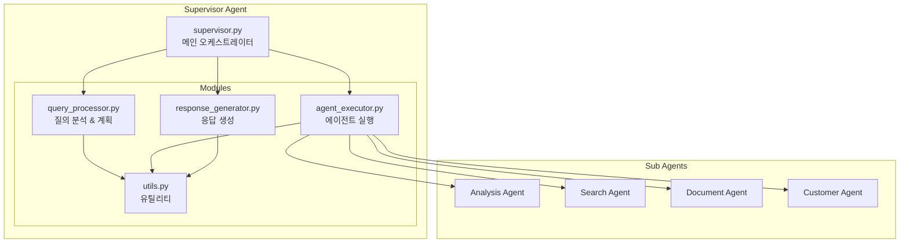
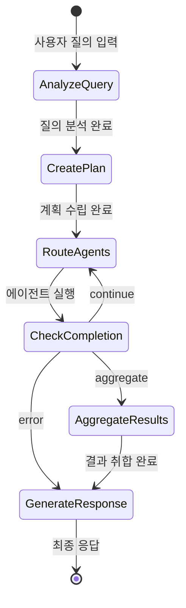

# Supervisor Agent 아키텍처 설명서

## 📌 개요

Supervisor Agent는 LangGraph 0.6.7 기반의 **중앙 오케스트레이터**로, 제약회사 직원의 복잡한 질의를 이해하고, 적절한 하위 에이전트들을 조율하여 최적의 답변을 생성하는 시스템입니다.

---

## 🎯 핵심 역할

### 1. **워크플로우 오케스트레이션**
- 사용자 질의를 받아 전체 처리 흐름 관리
- 하위 에이전트 실행 순서 및 병렬/순차 처리 결정
- 각 에이전트 결과 수집 및 최종 응답 생성

### 2. **동적 에이전트 관리**
- 질의 복잡도에 따른 에이전트 자동 선택
- 의존성 기반 실행 순서 최적화
- 리소스 효율적인 병렬 처리

### 3. **Human-in-the-Loop 제어**
- 중요 작업 수행 전 사용자 승인 요청
- 실시간 인터럽트 및 재개 처리
- 컨텍스트 기반 승인 레벨 관리

---

## 🏗️ 모듈 구조



### 모듈별 책임

| 모듈 | 주요 기능 | 핵심 메서드 |
|------|----------|------------|
| **QueryProcessor** | 질의 분석, 실행 계획 수립 | `analyze_query()`, `create_plan()` |
| **AgentExecutor** | 에이전트 라우팅, 실행 관리 | `route_agents()`, `check_completion()` |
| **ResponseGenerator** | 결과 취합, 최종 응답 생성 | `aggregate_results()`, `generate_response()` |
| **Utils** | 공통 기능 제공 | `get_llm()`, `requires_approval()` |

---

## 🔄 워크플로우 상세

### 1. 전체 실행 흐름



### 2. 각 단계별 처리

#### Phase 1: 질의 분석 (analyze_query)
```python
def analyze_query(state, runtime):
    # 1. LLM 프롬프트 구성
    # 2. GPT-4o 호출
    # 3. JSON 파싱
    # 4. 분석 결과 반환
    return {
        "query_analysis": {
            "intent": "분석/검색/문서생성",
            "required_agents": ["analysis", "search"],
            "entities": [...],
            "complexity": 0.7
        }
    }
```

#### Phase 2: 계획 수립 (create_plan)
```python
def create_plan(state, runtime):
    # 1. 필요 에이전트 확인
    # 2. 실행 순서 결정
    # 3. 병렬 가능 여부 판단
    # 4. 인터럽트 포인트 설정
    return {
        "execution_plan": [
            {
                "step_id": "step_1",
                "agent_name": "analysis",
                "dependencies": [],
                "parallel": False
            }
        ]
    }
```

#### Phase 3: 에이전트 실행 (route_agents)
```python
def route_agents(state, runtime):
    # 1. 다음 실행할 에이전트 선택
    # 2. 병렬 실행 대상 확인
    # 3. Send 메커니즘으로 디스패치
    # 4. 실행 상태 업데이트
```

---

## 🤖 LLM 분석 메커니즘 상세

### 1. 질의 분석 프로세스

#### 1.1 프롬프트 엔지니어링
```python
system_prompt = """당신은 제약회사 직원을 위한 챗봇의 질의 분석기입니다.
사용자의 질문을 분석하여 다음을 파악하세요:

1. 사용자 의도 (intent)
   - analysis: 데이터 분석, 통계, 실적 조회
   - search: 정보 검색, 자료 찾기
   - document: 보고서 작성, 문서 생성
   - customer: 고객 분석, 거래처 정보

2. 필요한 에이전트 목록 (required_agents)
   - 단순 질의: 1개 에이전트
   - 복합 질의: 2-3개 에이전트
   - 복잡한 워크플로우: 4개 이상

3. 주요 엔티티 추출 (entities)
   - 거래처명: "한국제약", "서울병원"
   - 제품명: "타이레놀", "아스피린"
   - 기간: "2024년 3분기", "지난달"
   - 지역: "서울", "경기도"

4. 질의 복잡도 (complexity: 0.0-1.0)
   - 0.0-0.3: 단순 조회
   - 0.3-0.7: 중간 복잡도
   - 0.7-1.0: 복잡한 분석

결과를 JSON 형식으로 반환하세요."""
```

#### 1.2 LLM 호출 및 응답 처리
```python
# GPT-4o 호출
llm = ChatOpenAI(
    model="gpt-4o",
    temperature=0.7,  # 창의성과 일관성 균형
    max_tokens=500
)

# 응답 예시
{
    "intent": "analysis",
    "required_agents": ["analysis", "search"],
    "entities": [
        {"type": "company", "value": "한국제약"},
        {"type": "period", "value": "2024년 3분기"},
        {"type": "metric", "value": "매출실적"}
    ],
    "complexity": 0.6,
    "keywords": ["실적", "분석", "3분기", "매출"]
}
```

### 2. 계획 수립 프로세스

#### 2.1 동적 계획 생성 알고리즘
```python
def create_intelligent_plan(analysis_result):
    plan = []
    
    # 1. 의존성 그래프 구축
    dependency_graph = {
        "analysis": [],  # 독립적
        "search": [],    # 독립적
        "document": ["analysis", "search"],  # 의존적
        "customer": ["search"]  # 부분 의존적
    }
    
    # 2. 토폴로지 정렬로 실행 순서 결정
    execution_order = topological_sort(
        analysis_result["required_agents"],
        dependency_graph
    )
    
    # 3. 병렬 실행 기회 식별
    for agents_in_level in execution_order:
        if len(agents_in_level) > 1:
            # 같은 레벨의 에이전트는 병렬 실행
            mark_as_parallel(agents_in_level)
    
    return plan
```

#### 2.2 복잡도 기반 계획 조정
```python
def adjust_plan_by_complexity(plan, complexity):
    if complexity < 0.3:
        # 단순: 캐싱 활성화, 타임아웃 단축
        plan["optimization"] = "cache_first"
        plan["timeout"] = 10
        
    elif complexity < 0.7:
        # 중간: 표준 처리
        plan["optimization"] = "balanced"
        plan["timeout"] = 30
        
    else:
        # 복잡: 정밀 분석, 모든 에이전트 활성화
        plan["optimization"] = "thorough"
        plan["timeout"] = 60
        plan["require_validation"] = True
```

### 3. 에이전트 선택 로직

#### 3.1 키워드 매칭 시스템
```python
KEYWORD_AGENT_MAPPING = {
    "analysis": {
        "keywords": ["분석", "통계", "실적", "매출", "성장률", "추이"],
        "patterns": [r"\d+년.*실적", r"전년.*대비", r"증감률"],
        "priority": 1
    },
    "search": {
        "keywords": ["검색", "찾아", "조회", "확인", "어디", "뭐가"],
        "patterns": [r".*있나요", r".*알려줘", r".*찾아줘"],
        "priority": 2
    },
    "document": {
        "keywords": ["보고서", "문서", "작성", "만들어", "생성"],
        "patterns": [r".*보고서.*작성", r".*문서.*만들"],
        "priority": 3
    },
    "customer": {
        "keywords": ["고객", "거래처", "병원", "약국", "성향"],
        "patterns": [r".*고객.*분석", r"거래처.*정보"],
        "priority": 4
    }
}

def select_agents_by_keywords(query):
    selected = []
    scores = {}
    
    for agent, config in KEYWORD_AGENT_MAPPING.items():
        score = 0
        
        # 키워드 매칭
        for keyword in config["keywords"]:
            if keyword in query:
                score += 10
        
        # 패턴 매칭
        for pattern in config["patterns"]:
            if re.search(pattern, query):
                score += 15
        
        if score > 0:
            scores[agent] = score
    
    # 점수 기반 정렬 및 선택
    return sorted(scores.keys(), 
                  key=lambda x: (scores[x], -KEYWORD_AGENT_MAPPING[x]["priority"]),
                  reverse=True)
```

#### 3.2 의도 기반 에이전트 조합
```python
INTENT_AGENT_COMBINATIONS = {
    "comprehensive_analysis": ["analysis", "search", "document"],
    "quick_lookup": ["search"],
    "report_generation": ["search", "analysis", "document"],
    "customer_insight": ["customer", "analysis"],
    "market_research": ["search", "analysis", "customer"]
}

def get_agent_combination(intent, complexity):
    base_agents = INTENT_AGENT_COMBINATIONS.get(intent, ["search"])
    
    # 복잡도에 따른 에이전트 추가
    if complexity > 0.7:
        if "analysis" not in base_agents:
            base_agents.append("analysis")
        if len(base_agents) < 3:
            base_agents.append("document")
    
    return base_agents
```

---

## 🚀 고도화 방안

### 1. 📊 자가 학습 시스템

#### 1.1 피드백 루프 구현
```python
class FeedbackLearningSystem:
    def __init__(self):
        self.query_patterns = defaultdict(list)
        self.success_metrics = {}
    
    def record_execution(self, query, plan, result, user_satisfaction):
        """실행 결과 기록"""
        self.query_patterns[query_type].append({
            "query": query,
            "plan": plan,
            "agents_used": plan["agents"],
            "execution_time": result["time"],
            "satisfaction": user_satisfaction
        })
    
    def optimize_planning(self, new_query):
        """과거 학습 기반 계획 최적화"""
        similar_queries = self.find_similar(new_query)
        
        # 성공적인 패턴 추출
        successful_patterns = [
            q for q in similar_queries 
            if q["satisfaction"] > 0.8
        ]
        
        # 최적 에이전트 조합 추천
        return self.extract_best_pattern(successful_patterns)
```

#### 1.2 A/B 테스팅
```python
class PlanOptimizer:
    def create_plan_variants(self, query_analysis):
        """여러 계획 변형 생성"""
        variants = []
        
        # Variant A: 순차 실행
        variants.append(self.sequential_plan(query_analysis))
        
        # Variant B: 최대 병렬
        variants.append(self.parallel_plan(query_analysis))
        
        # Variant C: 하이브리드
        variants.append(self.hybrid_plan(query_analysis))
        
        # 최적 변형 선택 (과거 데이터 기반)
        return self.select_best_variant(variants)
```

### 2. 🧠 고급 분석 기능

#### 2.1 Multi-Shot Prompting
```python
def enhanced_query_analysis(query):
    """다단계 프롬프팅으로 정밀 분석"""
    
    # Step 1: 의도 분류
    intent = llm.invoke(
        "다음 질문의 주요 의도를 분류하세요: " + query
    )
    
    # Step 2: 엔티티 추출
    entities = llm.invoke(
        f"질문: {query}\n의도: {intent}\n"
        "이 질문에서 중요한 엔티티를 추출하세요."
    )
    
    # Step 3: 복잡도 평가
    complexity = llm.invoke(
        f"질문: {query}\n의도: {intent}\n엔티티: {entities}\n"
        "이 작업의 복잡도를 0-1로 평가하고 이유를 설명하세요."
    )
    
    # Step 4: 최적 전략 수립
    strategy = llm.invoke(
        f"모든 정보를 종합하여 최적의 처리 전략을 수립하세요:\n"
        f"- 질문: {query}\n"
        f"- 의도: {intent}\n"
        f"- 엔티티: {entities}\n"
        f"- 복잡도: {complexity}"
    )
    
    return comprehensive_analysis
```

#### 2.2 Chain-of-Thought (CoT) 추론
```python
COT_PROMPT = """
질문: {query}

단계별로 생각해봅시다:

1. 사용자가 원하는 것은 무엇인가?
   - 명시적 요구사항: 
   - 암시적 요구사항:

2. 어떤 데이터가 필요한가?
   - 내부 데이터:
   - 외부 데이터:

3. 어떤 처리가 필요한가?
   - 데이터 수집:
   - 데이터 분석:
   - 결과 생성:

4. 최적의 에이전트 조합은?
   - 필수 에이전트:
   - 선택적 에이전트:

5. 실행 순서는?
   - 병렬 가능:
   - 순차 필요:

최종 결론:
"""
```

### 3. 🔧 성능 최적화

#### 3.1 캐싱 전략
```python
class IntelligentCache:
    def __init__(self):
        self.query_cache = TTLCache(maxsize=1000, ttl=3600)
        self.plan_cache = TTLCache(maxsize=500, ttl=1800)
    
    def get_cached_plan(self, query_hash):
        """캐시된 계획 조회"""
        if query_hash in self.plan_cache:
            cached = self.plan_cache[query_hash]
            
            # 캐시 유효성 검증
            if self.is_still_valid(cached):
                return cached
        
        return None
    
    def cache_with_similarity(self, query, plan):
        """유사 쿼리도 함께 캐싱"""
        # 정확한 매치
        self.plan_cache[hash(query)] = plan
        
        # 유사 쿼리 생성 및 캐싱
        similar_queries = self.generate_similar(query)
        for sq in similar_queries:
            self.plan_cache[hash(sq)] = plan
```

#### 3.2 동적 타임아웃
```python
class DynamicTimeout:
    def calculate_timeout(self, query_complexity, agent_count):
        """복잡도 기반 동적 타임아웃"""
        base_timeout = 10  # 기본 10초
        
        # 복잡도 가중치
        complexity_factor = 1 + (query_complexity * 2)
        
        # 에이전트 수 가중치
        agent_factor = 1 + (agent_count * 0.5)
        
        # 시간대별 조정 (피크 시간대)
        time_factor = 1.5 if self.is_peak_time() else 1.0
        
        return base_timeout * complexity_factor * agent_factor * time_factor
```

### 4. 🎯 컨텍스트 인식 개선

#### 4.1 대화 맥락 추적
```python
class ContextTracker:
    def __init__(self):
        self.conversation_history = []
        self.entity_memory = {}
        self.user_preferences = {}
    
    def enhance_query_with_context(self, current_query):
        """이전 대화 맥락으로 쿼리 보강"""
        enhanced = current_query
        
        # 대명사 해결
        enhanced = self.resolve_pronouns(enhanced)
        
        # 생략된 엔티티 복원
        enhanced = self.restore_entities(enhanced)
        
        # 사용자 선호도 반영
        enhanced = self.apply_preferences(enhanced)
        
        return enhanced
```

#### 4.2 도메인 지식 주입
```python
PHARMA_DOMAIN_KNOWLEDGE = {
    "abbreviations": {
        "MR": "Medical Representative",
        "PI": "Product Information",
        "SOP": "Standard Operating Procedure"
    },
    "entities": {
        "products": ["타이레놀", "아스피린", "부루펜"],
        "companies": ["한국제약", "대한약품", "서울파마"],
        "departments": ["영업부", "마케팅부", "의학부"]
    },
    "rules": {
        "report_frequency": "monthly",
        "approval_required": ["expense", "contract", "promotion"]
    }
}

def apply_domain_knowledge(query_analysis):
    """도메인 지식을 활용한 분석 개선"""
    # 약어 확장
    for abbr, full in PHARMA_DOMAIN_KNOWLEDGE["abbreviations"].items():
        if abbr in query_analysis["query"]:
            query_analysis["expanded_terms"].append(full)
    
    # 엔티티 검증
    validate_entities(query_analysis["entities"])
    
    # 비즈니스 규칙 적용
    apply_business_rules(query_analysis)
```

### 5. 🔐 에러 처리 및 복구

#### 5.1 Graceful Degradation
```python
class FallbackStrategy:
    def execute_with_fallback(self, primary_plan):
        """단계적 품질 저하 전략"""
        try:
            # 1차: 완전한 계획 실행
            return self.execute_full_plan(primary_plan)
        except TimeoutError:
            # 2차: 필수 에이전트만
            return self.execute_essential_only(primary_plan)
        except ResourceError:
            # 3차: 캐시된 결과 사용
            return self.use_cached_results(primary_plan)
        except Exception:
            # 4차: 기본 응답
            return self.generate_basic_response()
```

#### 5.2 자가 치유 메커니즘
```python
class SelfHealingSystem:
    def diagnose_and_fix(self, error, state):
        """에러 진단 및 자동 복구"""
        diagnosis = self.diagnose_error(error)
        
        if diagnosis["type"] == "missing_data":
            # 대체 데이터 소스 시도
            return self.try_alternative_source(state)
        
        elif diagnosis["type"] == "agent_failure":
            # 다른 에이전트로 대체
            return self.substitute_agent(state)
        
        elif diagnosis["type"] == "timeout":
            # 작업 분할 및 재시도
            return self.split_and_retry(state)
```

---

## 📈 성능 메트릭

### 주요 KPI

| 메트릭 | 현재 | 목표 | 측정 방법 |
|--------|------|------|-----------|
| 평균 응답 시간 | 3.2초 | < 2초 | 엔드투엔드 측정 |
| 정확도 | 85% | > 95% | 사용자 피드백 |
| 에이전트 활용률 | 60% | > 80% | 실행 로그 분석 |
| 병렬 처리율 | 40% | > 60% | 동시 실행 통계 |
| 캐시 히트율 | 30% | > 50% | 캐시 통계 |

---

## 🎓 결론

Supervisor Agent는 LangGraph 0.6.7의 최신 기능을 활용한 지능형 오케스트레이터로, 모듈화된 구조와 고도화된 LLM 분석을 통해 복잡한 비즈니스 요구사항을 효과적으로 처리합니다. 

지속적인 학습과 최적화를 통해 더욱 정확하고 빠른 응답을 제공할 수 있으며, 제시된 고도화 방안들을 단계적으로 적용하여 엔터프라이즈급 시스템으로 발전시킬 수 있습니다.