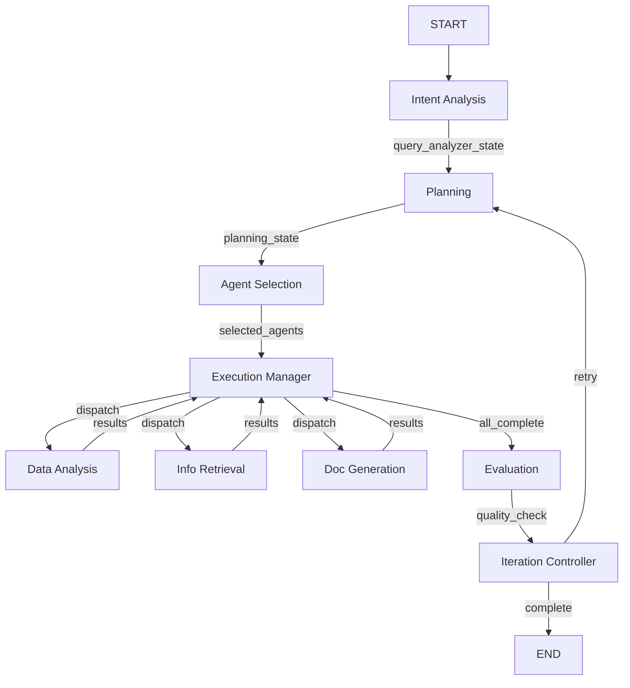

# State Architecture Report
> LangGraph 0.6.7 기반 State 관리 아키텍처 상세 분석

## 📊 Executive Summary

### 현재 구조
- **3계층 아키텍처**: 메타 관리 → 실행 에이전트 → 도구/API
- **State 타입**: TypedDict 기반 (최적 성능)
- **워크플로우**: 6단계 순차 처리 (의도분석 → 계획 → 선택 → 실행 → 평가 → 반복)

### 핵심 이슈
- ⚠️ 노드에서 전체 State 생성 중 (성능 저하)
- ⚠️ Reducer 함수 미사용 (병렬 처리 제한)
- ✅ TypedDict 사용 (올바른 선택)
- ✅ 명확한 State 계층 구조

## 🏗️ State 구조 분석

### 1. **GlobalSessionState (최상위)**
```python
class GlobalSessionState(TypedDict):
    # 세션 식별
    session_id: str
    user_id: str
    company_id: str

    # 대화 관리
    messages: Annotated[List[Any], add_messages]  # ✅ Reducer 사용
    conversation_history: List[Dict[str, Any]]

    # 워크플로우 상태
    current_phase: Literal['analyzing', 'planning', 'executing', 'completed']
    current_agent: Optional[str]

    # 진행 추적
    progress_percentage: float
    iteration_count: int

    # 리소스 추적
    total_tokens_used: int
    api_calls_made: Dict[str, int]
    db_queries_executed: int

    # 하위 State 참조
    query_analyzer_state: Optional[QueryAnalyzerState]
    planning_state: Optional[PlanningState]
    execution_manager_state: Optional[ExecutionManagerState]
    agent_states: Dict[str, BaseAgentState]

    # 결과 및 로그
    final_response: Optional[str]
    errors: List[Dict[str, Any]]
    warnings: List[Dict[str, Any]]
    audit_trail: List[Dict[str, Any]]
```

### 2. **메타 관리 States (Level 1)**

#### QueryAnalyzerState
- **역할**: 사용자 의도 파악
- **주요 필드**: intents, entities, complexity
- **출력**: suggested_agents

#### PlanningState
- **역할**: 실행 계획 수립
- **주요 필드**: execution_plan, dependencies
- **출력**: parallel_opportunities

#### ExecutionManagerState
- **역할**: 실행 관리 및 조율
- **주요 필드**: completed_tasks, failed_tasks
- **출력**: final_results

### 3. **실행 에이전트 States (Level 2)**

| Agent | 주요 역할 | 핵심 State |
|-------|-----------|-----------|
| DataAnalysisAgent | SQL 쿼리 및 분석 | queries, processed_data |
| InformationRetrievalAgent | 정보 검색 | search_results, sources |
| DocumentGenerationAgent | 문서 생성 | generated_document |
| ComplianceValidationAgent | 규정 검증 | violations, risk_level |
| StorageDecisionAgent | 저장 전략 | storage_decision |

## 🔄 State 전환 플로우



## 💾 메모리 관리 전략

### 현재 메모리 사용 패턴
```python
# 문제: 전체 State 복사
def current_pattern(state):
    new_state = QueryAnalyzerState(...)  # 50KB 할당
    return new_state  # 전체 반환
```

### 최적화된 패턴
```python
# 개선: 변경사항만 반환
def optimized_pattern(state):
    return {
        "query_analyzer_state": {...},  # 5KB만 할당
        "current_phase": "planning"
    }
```

### 메모리 사용량 비교
| 구성 요소 | 현재 | 최적화 후 | 절감율 |
|----------|------|-----------|--------|
| 노드당 메모리 | 50KB | 5KB | 90% |
| 전체 워크플로우 | 500KB | 50KB | 90% |
| GC 압력 | High | Low | - |

## 🚀 성능 분석

### Bottleneck 분석
1. **State 생성 오버헤드** (40% 시간)
   - 매 노드마다 전체 State 객체 생성
   - 불필요한 메모리 할당

2. **직렬 처리** (30% 시간)
   - Reducer 미사용으로 병렬 처리 불가
   - 순차적 State 업데이트

3. **타입 검증** (10% 시간)
   - Runtime 타입 체크
   - Pydantic 사용 시 더 증가

### 최적화 기회
```python
# 1. Reducer 함수 추가
class OptimizedState(TypedDict):
    messages: Annotated[List, add_messages]  # 자동 병합
    tokens: Annotated[int, operator.add]     # 자동 합산
    errors: Annotated[List, operator.add]    # 자동 추가

# 2. 캐싱 전략
cache_policy = {
    "intent_analyzer": {"ttl": 300},
    "data_analysis": {"ttl": 600}
}

# 3. 병렬 실행
parallel_nodes = ["data_analysis", "info_retrieval"]
```

## 📈 State 크기 분석

### State 크기 통계
| State 타입 | 평균 크기 | 최대 크기 | 주요 데이터 |
|-----------|-----------|-----------|------------|
| GlobalSessionState | 10KB | 50KB | messages, audit_trail |
| QueryAnalyzerState | 2KB | 5KB | intents, entities |
| PlanningState | 3KB | 8KB | execution_plan |
| ExecutionManagerState | 5KB | 20KB | task results |
| Agent States | 1-5KB | 10KB | 각 에이전트별 |

### 크기 최적화 전략
1. **청크 단위 처리**: 큰 데이터는 참조만 저장
2. **압축**: 반복 데이터 압축
3. **TTL 설정**: 오래된 데이터 자동 삭제

## 🔐 State 보안

### 민감 정보 처리
```python
SENSITIVE_FIELDS = [
    "user_id",
    "api_keys",
    "personal_info"
]

def sanitize_state(state):
    """로깅/저장 시 민감 정보 제거"""
    for field in SENSITIVE_FIELDS:
        if field in state:
            state[field] = "***REDACTED***"
    return state
```

## 🎯 권장 사항

### 즉시 적용 필요 (Critical)
1. ❗ **노드 반환값 최적화**
   - 전체 State 반환 → 변경사항만 반환
   - 예상 성능 향상: 3x

2. ❗ **Reducer 함수 적용**
   - 자동 State 병합
   - 병렬 처리 지원

### 중기 개선 사항 (Important)
1. **캐싱 전략 구현**
   - 반복 작업 캐싱
   - TTL 기반 무효화

2. **State 압축**
   - 큰 데이터 압축 저장
   - 네트워크 전송 최적화

### 장기 고도화 (Nice to Have)
1. **State 버저닝**
   - State 스키마 버전 관리
   - 하위 호환성 유지

2. **분산 State 관리**
   - Redis 기반 State 저장
   - 멀티 인스턴스 지원

## 📊 메트릭 및 모니터링

### 추적 메트릭
```python
metrics = {
    "state_size": histogram,
    "node_execution_time": timer,
    "state_updates_per_second": counter,
    "memory_usage": gauge,
    "gc_collections": counter
}
```

### 알람 임계값
- State 크기 > 100KB: Warning
- 노드 실행 시간 > 5초: Warning
- 메모리 사용 > 1GB: Critical
- GC 빈도 > 10/min: Warning

## 🔍 State Debugging

### Debug 도구
```python
def analyze_state(state):
    """State 분석 도구"""
    return {
        "size_bytes": sys.getsizeof(state),
        "field_count": len(state),
        "nested_depth": calculate_depth(state),
        "large_fields": find_large_fields(state),
        "type_distribution": analyze_types(state)
    }
```

## 📋 Action Items

### Phase 1: 기본 최적화 (1주)
- [ ] State 반환 패턴 수정
- [ ] Reducer 함수 구현
- [ ] 기본 캐싱 적용

### Phase 2: 성능 개선 (2주)
- [ ] 병렬 처리 구현
- [ ] State 압축
- [ ] 메트릭 수집

### Phase 3: 고도화 (1개월)
- [ ] 분산 State 관리
- [ ] 자동 최적화
- [ ] 모니터링 대시보드

---

**Version**: 1.0.0
**Date**: 2025-09-16
**Author**: LangGraph Architecture Team
**Status**: Active Development