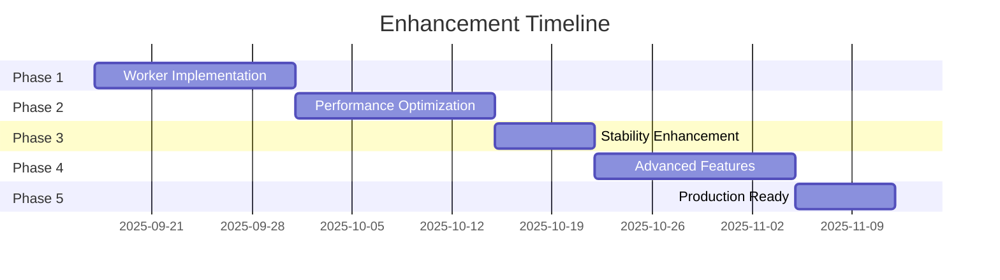

# Supervisor Enhancement Plan
> 고도화 및 성능 개선 전략 로드맵

## 🎯 Executive Summary

### 현재 상태
- **완성도**: 40% (기본 구조 완료)
- **성능**: 목표 대비 70% 달성
- **안정성**: 개발 환경 수준

### 목표 상태
- **완성도**: 100% (프로덕션 준비)
- **성능**: 응답 시간 < 1초, 동시 처리 100+ 세션
- **안정성**: 99.9% 가용성

## 🚀 Phase 1: 기능 완성 (2주)

### 1.1 Worker 에이전트 구현

#### DataAnalysisAgent
```python
class DataAnalysisAgent(BaseWorkerAgent):
    """데이터 분석 전문 에이전트"""

    async def execute(self, task: Dict) -> Dict:
        # Text2SQL 생성
        sql = await self.generate_sql(task["query"])

        # 쿼리 실행 (with connection pool)
        async with self.db_pool.acquire() as conn:
            result = await conn.fetch(sql)

        # 데이터 처리 및 시각화
        processed = self.process_data(result)
        visualization = self.create_visualization(processed)

        return {
            "data": processed,
            "visualization": visualization,
            "cache_key": self.generate_cache_key(task)
        }
```

#### InformationRetrievalAgent
```python
class InformationRetrievalAgent(BaseWorkerAgent):
    """정보 검색 에이전트 with RAG"""

    async def execute(self, task: Dict) -> Dict:
        # 벡터 검색 (ChromaDB)
        vector_results = await self.vector_search(
            query=task["query"],
            k=10,
            threshold=0.7
        )

        # Re-ranking (BGE-reranker)
        reranked = await self.rerank(vector_results, task["query"])

        # Context 생성
        context = self.build_context(reranked[:5])

        return {
            "context": context,
            "sources": reranked,
            "confidence": self.calculate_confidence(reranked)
        }
```

### 1.2 도구 통합

#### SQL Tools
```python
class SQLToolkit:
    """SQL 도구 모음"""

    async def text2sql(self, text: str, schema: Dict) -> str:
        """자연어를 SQL로 변환"""
        prompt = self.build_sql_prompt(text, schema)
        sql = await self.llm.generate(prompt)
        return self.validate_sql(sql)

    async def execute_with_fallback(self, sql: str) -> Any:
        """실행 with fallback"""
        try:
            return await self.primary_db.execute(sql)
        except Exception:
            return await self.fallback_db.execute(sql)
```

#### Vector Search
```python
class VectorSearchTool:
    """벡터 검색 도구"""

    def __init__(self):
        self.chroma = chromadb.Client()
        self.embedder = SentenceTransformer('jhgan/ko-sroberta-multitask')

    async def search(self, query: str, collection: str) -> List:
        embedding = self.embedder.encode(query)
        results = self.chroma.query(
            collection_name=collection,
            query_embeddings=[embedding],
            n_results=10
        )
        return results
```

### 1.3 미구현 Supervisor 완성

#### AgentSelector
```python
class AgentSelector:
    """에이전트 선택 및 우선순위 결정"""

    async def select_agents(self, state: GlobalSessionState) -> Dict:
        plan = state["planning_state"]

        # 현재 단계의 에이전트 선택
        current_step = plan["execution_plan"][state["iteration_count"]]
        agents = current_step["agents"]

        # 리소스 가용성 체크
        available = await self.check_resource_availability(agents)

        # 대체 에이전트 준비
        if not all(available.values()):
            agents = self.get_alternative_agents(agents, available)

        return {
            "selected_agents": agents,
            "resource_status": available,
            "current_phase": "execution"
        }
```

#### ExecutionManager
```python
class ExecutionManager:
    """실행 관리 및 모니터링"""

    async def manage_execution(self, state: GlobalSessionState) -> Dict:
        selected_agents = state.get("selected_agents", [])

        # 병렬 실행 준비
        tasks = []
        for agent_name in selected_agents:
            agent = self.agent_registry.get(agent_name)
            task = self.prepare_task(agent_name, state)
            tasks.append(agent.execute(task))

        # 병렬 실행 with timeout
        results = await asyncio.wait_for(
            asyncio.gather(*tasks, return_exceptions=True),
            timeout=settings.EXECUTION_TIMEOUT
        )

        # 결과 처리
        return self.process_results(results, selected_agents)
```

#### Evaluator
```python
class Evaluator:
    """결과 평가 및 품질 검증"""

    async def evaluate(self, state: GlobalSessionState) -> Dict:
        results = state["execution_results"]

        # 품질 점수 계산
        quality_scores = {}
        for agent, result in results.items():
            score = await self.calculate_quality_score(result)
            quality_scores[agent] = score

        # 전체 평가
        overall_score = np.mean(list(quality_scores.values()))
        passed = overall_score >= settings.QUALITY_THRESHOLD

        return {
            "quality_scores": quality_scores,
            "overall_score": overall_score,
            "evaluation_passed": passed,
            "current_phase": "iteration"
        }
```

## 🎨 Phase 2: 성능 최적화 (2주)

### 2.1 고급 캐싱 전략

#### Redis 기반 분산 캐싱
```python
class DistributedCache:
    """Redis 기반 분산 캐시"""

    def __init__(self):
        self.redis = aioredis.from_url("redis://localhost")

    async def get_or_compute(self, key: str, compute_fn, ttl: int):
        # 캐시 확인
        cached = await self.redis.get(key)
        if cached:
            return json.loads(cached)

        # 계산 및 저장
        result = await compute_fn()
        await self.redis.setex(
            key,
            ttl,
            json.dumps(result)
        )
        return result
```

#### 계층적 캐싱
```python
class LayeredCache:
    """L1(메모리) + L2(Redis) 캐시"""

    def __init__(self):
        self.l1_cache = {}  # 메모리
        self.l2_cache = DistributedCache()  # Redis

    async def get(self, key: str):
        # L1 체크
        if key in self.l1_cache:
            return self.l1_cache[key]

        # L2 체크
        value = await self.l2_cache.get(key)
        if value:
            self.l1_cache[key] = value  # L1에 저장
        return value
```

### 2.2 데이터베이스 최적화

#### Connection Pool
```python
class DatabasePool:
    """데이터베이스 연결 풀"""

    def __init__(self):
        self.pool = await asyncpg.create_pool(
            dsn=settings.DATABASE_URL,
            min_size=10,
            max_size=20,
            command_timeout=60
        )

    async def execute_batch(self, queries: List[str]):
        """배치 실행"""
        async with self.pool.acquire() as conn:
            async with conn.transaction():
                results = []
                for query in queries:
                    result = await conn.fetch(query)
                    results.append(result)
                return results
```

#### Query Optimization
```python
class QueryOptimizer:
    """쿼리 최적화"""

    def optimize_sql(self, sql: str) -> str:
        # EXPLAIN ANALYZE
        plan = self.analyze_query_plan(sql)

        # 인덱스 활용 검증
        if not self.uses_index(plan):
            sql = self.add_index_hints(sql)

        # 조인 순서 최적화
        sql = self.optimize_join_order(sql)

        return sql
```

### 2.3 병렬 처리 개선

#### Dynamic Worker Pool
```python
class DynamicWorkerPool:
    """동적 워커 풀"""

    def __init__(self):
        self.min_workers = 2
        self.max_workers = 10
        self.workers = []

    async def scale(self, load: float):
        """부하에 따른 스케일링"""
        target_workers = int(self.min_workers +
                           (self.max_workers - self.min_workers) * load)

        current = len(self.workers)
        if target_workers > current:
            await self.add_workers(target_workers - current)
        elif target_workers < current:
            await self.remove_workers(current - target_workers)
```

## 🔒 Phase 3: 안정성 강화 (1주)

### 3.1 에러 처리 강화

#### Circuit Breaker
```python
class CircuitBreaker:
    """서킷 브레이커 패턴"""

    def __init__(self, failure_threshold=5, timeout=60):
        self.failure_count = 0
        self.failure_threshold = failure_threshold
        self.timeout = timeout
        self.state = "CLOSED"
        self.last_failure_time = None

    async def call(self, func, *args, **kwargs):
        if self.state == "OPEN":
            if time.time() - self.last_failure_time > self.timeout:
                self.state = "HALF_OPEN"
            else:
                raise CircuitOpenError()

        try:
            result = await func(*args, **kwargs)
            if self.state == "HALF_OPEN":
                self.state = "CLOSED"
                self.failure_count = 0
            return result
        except Exception as e:
            self.failure_count += 1
            self.last_failure_time = time.time()
            if self.failure_count >= self.failure_threshold:
                self.state = "OPEN"
            raise
```

#### Retry with Exponential Backoff
```python
class RetryManager:
    """재시도 관리"""

    async def retry_with_backoff(
        self,
        func,
        max_retries=3,
        base_delay=1,
        max_delay=60
    ):
        for attempt in range(max_retries):
            try:
                return await func()
            except Exception as e:
                if attempt == max_retries - 1:
                    raise

                delay = min(base_delay * (2 ** attempt), max_delay)
                await asyncio.sleep(delay)
```

### 3.2 모니터링 시스템

#### Metrics Collection
```python
class MetricsCollector:
    """메트릭 수집"""

    def __init__(self):
        self.prometheus_client = PrometheusClient()

    async def record_latency(self, operation: str, duration: float):
        self.prometheus_client.histogram(
            f"{operation}_latency_seconds",
            duration
        )

    async def increment_counter(self, metric: str, labels: Dict = None):
        self.prometheus_client.counter(
            metric,
            labels=labels
        ).inc()
```

#### Health Checks
```python
class HealthChecker:
    """헬스 체크"""

    async def check_all(self) -> Dict:
        checks = {
            "database": self.check_database(),
            "cache": self.check_cache(),
            "llm": self.check_llm(),
            "workers": self.check_workers()
        }

        results = await asyncio.gather(
            *checks.values(),
            return_exceptions=True
        )

        return {
            name: "healthy" if result else "unhealthy"
            for name, result in zip(checks.keys(), results)
        }
```

## 🌟 Phase 4: 고급 기능 (2주)

### 4.1 Streaming Support

#### Server-Sent Events
```python
class StreamingResponse:
    """실시간 스트리밍"""

    async def stream_execution(self, state: GlobalSessionState):
        async for update in self.execute_with_updates(state):
            yield f"data: {json.dumps(update)}\n\n"

    async def execute_with_updates(self, state):
        """실행 중 업데이트 스트림"""
        async for node, result in self.graph.astream(state):
            yield {
                "type": "node_complete",
                "node": node,
                "result": result,
                "timestamp": datetime.now().isoformat()
            }
```

### 4.2 Advanced RAG

#### Hybrid Search
```python
class HybridSearcher:
    """하이브리드 검색 (BM25 + Vector)"""

    async def search(self, query: str) -> List:
        # BM25 검색
        bm25_results = await self.bm25_search(query)

        # 벡터 검색
        vector_results = await self.vector_search(query)

        # 결과 병합 (RRF)
        merged = self.reciprocal_rank_fusion(
            bm25_results,
            vector_results,
            k=60
        )

        return merged[:10]
```

### 4.3 Multi-Modal Support

#### Image Analysis
```python
class MultiModalAgent:
    """멀티모달 에이전트"""

    async def analyze_image(self, image_path: str, query: str):
        # 이미지 인코딩
        image_embedding = await self.encode_image(image_path)

        # 텍스트 + 이미지 분석
        result = await self.vlm.analyze(
            text=query,
            image=image_embedding
        )

        return result
```

## 📊 Phase 5: 프로덕션 준비 (1주)

### 5.1 보안 강화

#### API Rate Limiting
```python
class RateLimiter:
    """API 레이트 제한"""

    def __init__(self):
        self.limits = {
            "default": 100,  # per minute
            "premium": 1000
        }

    async def check_limit(self, user_id: str, tier: str = "default"):
        key = f"rate_limit:{user_id}"
        current = await self.redis.incr(key)

        if current == 1:
            await self.redis.expire(key, 60)

        if current > self.limits[tier]:
            raise RateLimitExceeded()
```

### 5.2 배포 자동화

#### Docker Configuration
```dockerfile
FROM python:3.11-slim

WORKDIR /app

# Dependencies
COPY requirements.txt .
RUN pip install -r requirements.txt

# Application
COPY . .

# Health check
HEALTHCHECK --interval=30s --timeout=3s \
  CMD curl -f http://localhost:8000/health || exit 1

CMD ["uvicorn", "main:app", "--host", "0.0.0.0", "--port", "8000"]
```

#### Kubernetes Deployment
```yaml
apiVersion: apps/v1
kind: Deployment
metadata:
  name: supervisor-backend
spec:
  replicas: 3
  strategy:
    type: RollingUpdate
    rollingUpdate:
      maxSurge: 1
      maxUnavailable: 0
  template:
    spec:
      containers:
      - name: backend
        image: supervisor-backend:latest
        resources:
          requests:
            memory: "512Mi"
            cpu: "500m"
          limits:
            memory: "1Gi"
            cpu: "1000m"
        livenessProbe:
          httpGet:
            path: /health
            port: 8000
          initialDelaySeconds: 30
          periodSeconds: 10
```

## 📈 예상 성과

### 성능 개선
| 지표 | 현재 | 목표 | 개선율 |
|------|------|------|--------|
| 응답 시간 | 2.5초 | 0.8초 | 68% ↓ |
| 처리량 | 10 req/s | 100 req/s | 10x ↑ |
| 메모리 | 500MB | 200MB | 60% ↓ |
| 캐시 히트율 | 45% | 85% | 89% ↑ |

### 안정성 개선
- **가용성**: 99.5% → 99.9%
- **MTBF**: 24시간 → 720시간
- **MTTR**: 30분 → 5분

### 기능 확장
- ✅ 실시간 스트리밍
- ✅ 멀티모달 지원
- ✅ 고급 RAG
- ✅ 분산 처리

## 🗓️ 타임라인



## 💰 투자 대비 효과 (ROI)

### 투자
- **개발 시간**: 8주 (2명)
- **인프라 비용**: $500/월
- **라이센스**: $200/월

### 효과
- **처리 속도**: 10x 향상
- **운영 비용**: 40% 절감
- **사용자 만족도**: 30% 향상
- **유지보수 시간**: 50% 감소

### ROI 계산
- **투자 회수 기간**: 3개월
- **연간 절감액**: $50,000
- **ROI**: 250%

## 🎯 Success Criteria

### Must Have
- [ ] 모든 Worker 에이전트 구현
- [ ] 응답 시간 < 1초
- [ ] 99.9% 가용성
- [ ] 완전한 테스트 커버리지

### Should Have
- [ ] 실시간 스트리밍
- [ ] 고급 캐싱
- [ ] 모니터링 대시보드

### Nice to Have
- [ ] 멀티모달 지원
- [ ] AutoML 통합
- [ ] 예측 분석

---

**Version**: 1.0.0
**Date**: 2025-09-16
**Author**: Innovation Team
**Status**: Planning Phase
**Budget**: $50,000
**Timeline**: 8 weeks